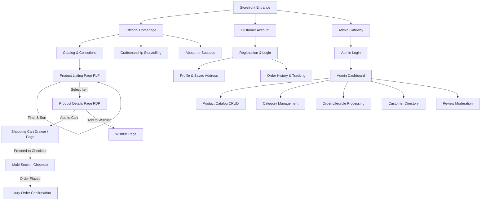

# MAHESH DESIGNER — Experience & Interaction Architecture (EXPERIENCE.md)

## 1. Foundation & Design System Alignment

- **Visual Reference:** All styling, colors, and layout tokens strictly adhere to [`DESIGN.md`](file:///d:/cake%20shop%20bmad/_bmad-output/planning-artifacts/DESIGN.md) tokens (`{tokens.colors.*}`, `{tokens.typography.*}`).
- **Primary Form Factor:** Mobile-first, responsive editorial web application optimized across 320px (Mobile), 768px (Tablet), 1024px (Laptop), and 1440px+ (Desktop).
- **Core Experience Principle:** *Tactile Luxury & Effortless Precision*. The user must feel the bespoke prestige of the bridal boutique while enjoying lightning-fast catalog exploration and frictionless ordering.

---

## 2. Information Architecture & Site Map

### Route & Screen Map

| Route Path | Screen Name | Key Interactivity |
| :--- | :--- | :--- |
| `/` | Editorial Homepage | Hero banner, Collections grid, Dynamic product reel, Aari story, Instagram feed |
| `/collections` | Collections Showcase | Editorial landing for Bridal Blouses, Lehengas, Reception Gowns, Kurtis |
| `/products` | Product Listing Page | Multi-faceted sidebar filter, instant sort, responsive product cards |
| `/products/:id` | Product Details Page | Multi-image gallery with macro zoom, size selector, customization toggle |
| `/wishlist` | Customer Wishlist | Persisted items, 1-click move to cart, empty state |
| `/cart` | Cart Drawer / Page | Real-time quantity modifier, stock check, discount summary |
| `/checkout` | Checkout Flow | Address verification, delivery selection, payment confirmation |
| `/orders/:id` | Order Tracking | Real-time lifecycle stepper (`Pending` → `Delivered`) |
| `/account` | Customer Profile | Personal info, saved addresses, past orders |
| `/admin/login` | Admin Authentication | Isolated back-office login portal |
| `/admin/dashboard` | Admin Dashboard | Revenue summary, pending orders, product/category management |

---

## 3. Voice & Tone (Microcopy Guide)

The voice of MAHESH DESIGNER is **warm, respectful, prestigious, and knowledgeable** — like a personal bridal couture consultant.

### Microcopy Standards

| Context | Good Example | Anti-Pattern to Avoid |
| :--- | :--- | :--- |
| **Empty Wishlist** | *"Your wishlist is waiting for something beautiful. Explore our handcrafted bridal collections."* | *"You have no items in your wishlist."* |
| **Empty Cart** | *"Your bridal box is currently empty. Discover our new arrivals to begin."* | *"Cart is empty. Buy stuff now."* |
| **Out of Stock** | *"Currently reserved. Request bespoke piece or join priority waitlist."* | *"Error: 0 items in stock!"* |
| **Order Placed** | *"Thank you for trusting Mahesh Designer with your special moment. Your bespoke order has been received."* | *"Order placed successfully. We got your money."* |
| **Image Upload** | *"Upload high-resolution photography showcasing rich embroidery details."* | *"Choose file."* |

---

## 4. Behavioral Component Patterns

### 4.1 Global Navbar & Header
- **Initial State:** Warm Ivory background, subtle `#EDE3D5` bottom border, center-aligned luxury serif brand mark.
- **Scroll Behavior:** Transitions smoothly to sticky compact header (`height: 64px`), adds subtle glassmorphic backdrop blur and elevation (`0 8px 24px rgba(36, 25, 27, 0.08)`).
- **Mobile Drawer:** Sliding panel from the left with spring-physics easing, categorizing bridal categories with expandable sub-links.

### 4.2 Multi-Faceted Catalog Filtering & Sorting
- **Desktop Filter:** Left-hand sticky sidebar with accordion facets (Category, Fabric, Embroidery Type, Color Swatches, Price Range Slider, Size Chips).
- **Mobile Filter:** Bottom slide-up drawer with sticky "Apply Filters (N results)" button.
- **Instant Response:** Filter selections update the product grid asynchronously without full-page reloads, displaying an animated count indicator.

### 4.3 Product Details Page (PDP) Interactive Gallery
- **Main Viewport:** High-resolution fashion image with smooth cursor-driven 2x macro magnifying loupe to inspect fine Aari needlework.
- **Thumbnail Strip:** Horizontal or vertical list of angle thumbnails with active gold outline indicator.
- **Size Selector:** Interactive size chips (XS, S, M, L, XL, Custom) with real-time stock feedback ("Only 2 left" or "Custom fit available upon order").
- **Customization Modal:** Allows customer to input specific measurements or bridal color alterations.

### 4.4 Slide-Out Shopping Cart Drawer
- Tapping "Add to Cart" triggers a subtle notification and slides open the right-hand mini-cart drawer without taking the shopper off the current page.
- Displays free shipping threshold progress bar, selected item thumbnails, quantity steppers, and a prominent "Proceed to Checkout" button.

### 4.5 Multi-Section Checkout
- Single-page accordion or sequential progress stepper:
  1. Customer Contact & Delivery Address
  2. Order Review & Bespoke Notes
  3. Payment & Confirmation
- Inline field validation on blur with clear error indications.

---

## 5. State Patterns & Feedback Mechanisms

### 5.1 Loading Skeletons
- Replaces generic spinners with shimmering warm cream skeleton boxes matching exact card and image aspect ratios (`3:4`).

### 5.2 Empty States
- Custom illustrated or styled luxury placeholder with clear primary action CTA button leading back to Collections.

### 5.3 Error & Warning Toasts
- Floating unobtrusive toast at bottom-right of viewport with burgundy/maroon accents and gold icon, auto-dismissing after 4 seconds.

---

## 6. Admin Portal Interaction Architecture

- **Dedicated Layout:** Dark Burgundy (`#3A0D18`) left sidebar with gold active indicators; high-contrast clean white content workspace.
- **Product Management:** Tabbed modal or dedicated page for Basic Details, Image Drag & Drop Preview, Fashion Specifications, Inventory & Pricing.
- **Order Lifecycle Stepper:** 1-click status transitions with confirmation modal for irreversible actions (e.g. Cancelling an order).
- **Data Tables:** Search bar, category filter, multi-row selection, sortable columns, and paginated rows (10/25/50 items per page).

---

## 7. Accessibility Floor (a11y)

- **Contrast Compliance:** All text tokens meet or exceed WCAG 2.1 AA requirements (minimum 4.5:1 for normal text, 3:1 for large headings against background).
- **Keyboard Navigation:** Full focus-visible rings with gold border (`#C9A227`) on all interactive controls (`a`, `button`, `input`, `select`).
- **Screen Reader Support:** Semantic HTML5 landmarks (`<header>`, `<nav>`, `<main>`, `<aside>`, `<footer>`), `aria-expanded` on accordion filters, and descriptive `alt` tags on all product imagery.
